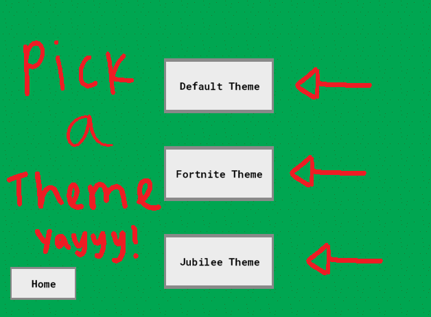

# Tower Defense Game


Welcome to the **Tower Defense Game**, my first GameMaker Studio 2 project built to showcase a mix of tower defense, resource management, and  gameplay. This game features three themes. It was developed to deepen my understanding of GameMaker Language (GML) and to explore game development workflows.

---

## Table of Contents

- [Features](#features)
- [Gameplay Instructions](#gameplay-instructions)
- [Screenshots](#screenshots)
- [How to Play](#how-to-play)
- [Installation](#installation)

---

## Features

- **Multiple Towers**: Build Towers based of resources.
- **Increase difficulty**: After leveling up difficulty will increase .
- **Coins**: Coins are recieved when boids are destroyed.
- **Unlimited Levels**: Enjoy approximately 40 minutes of gameplay before the levels become imposible to pass.
---

## Gameplay Instructions
- If the Boids Reach the Finish Line, You Lose a Life.
- Left Click on a Tower to Buy it.
- Left Click Again to Place Item Down.
- You Cannot Place the Tower on Itself or on the Path the Boids Travel.
- Hover over Items After its PLaced to see Shooting Range.
- Toggle full-screen with `F`.
---

## Screenshots

### Game Start


### Theme Selection


### Default Theme


### Fortnite Theme


### Instructions Page


---

## How to Play

1. Download and extract the **exe** build from the releases page from https://jes4l.itch.io/jesals-tower-defence .
2. Launch the game by double-clicking the `.exe` file.

---

## Installation

1. Clone the repository:
   ```bash
   git clone https://github.com/jes4l/tower-defence.git
